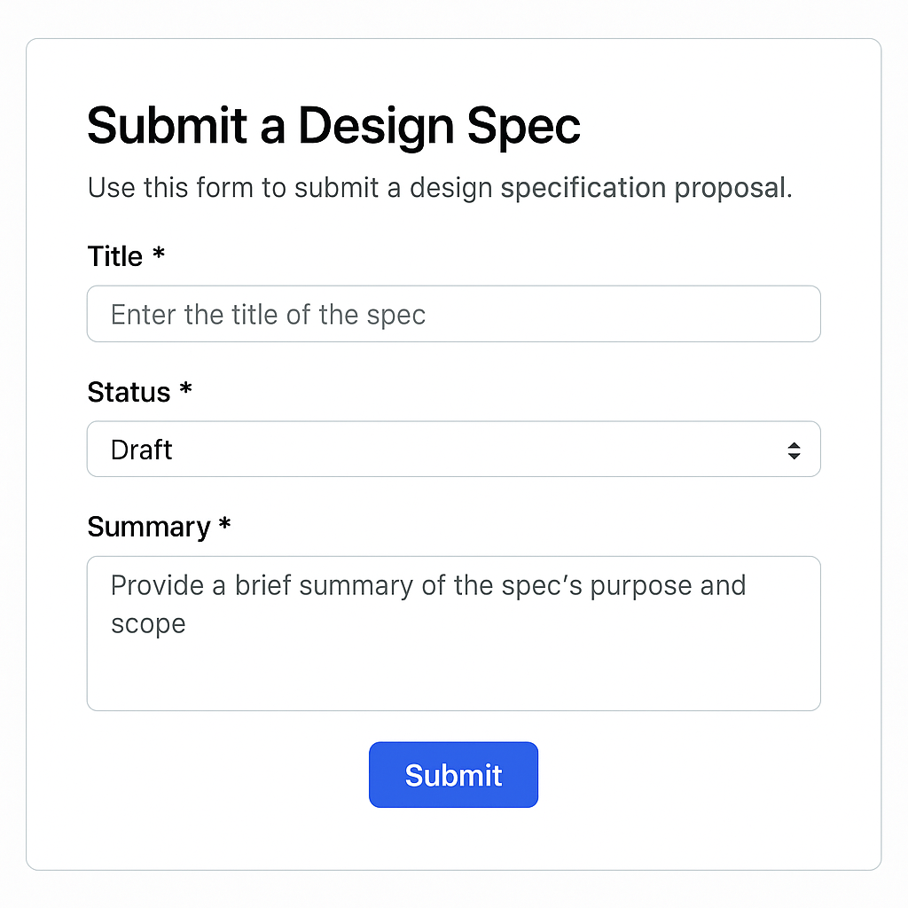
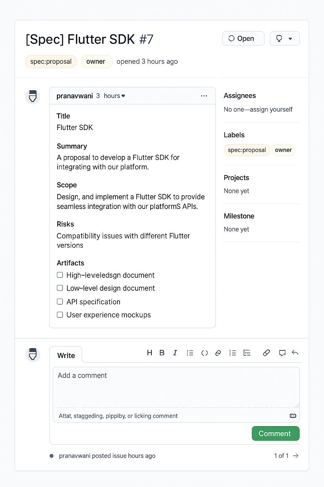
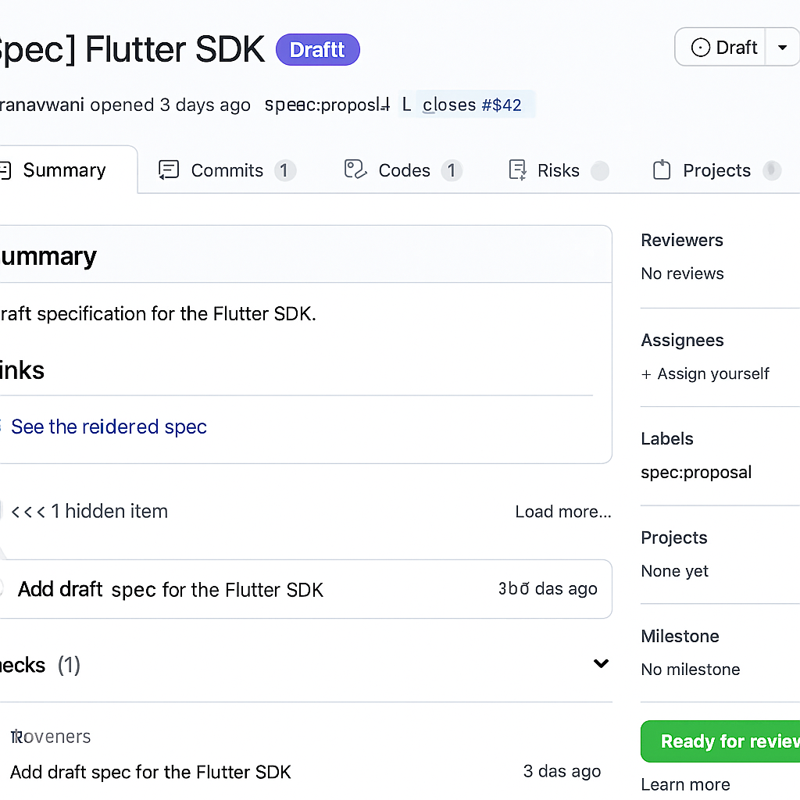
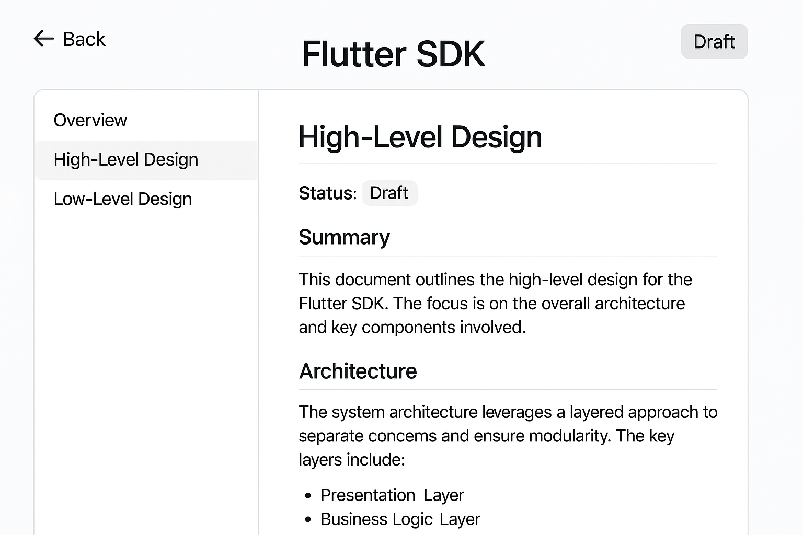
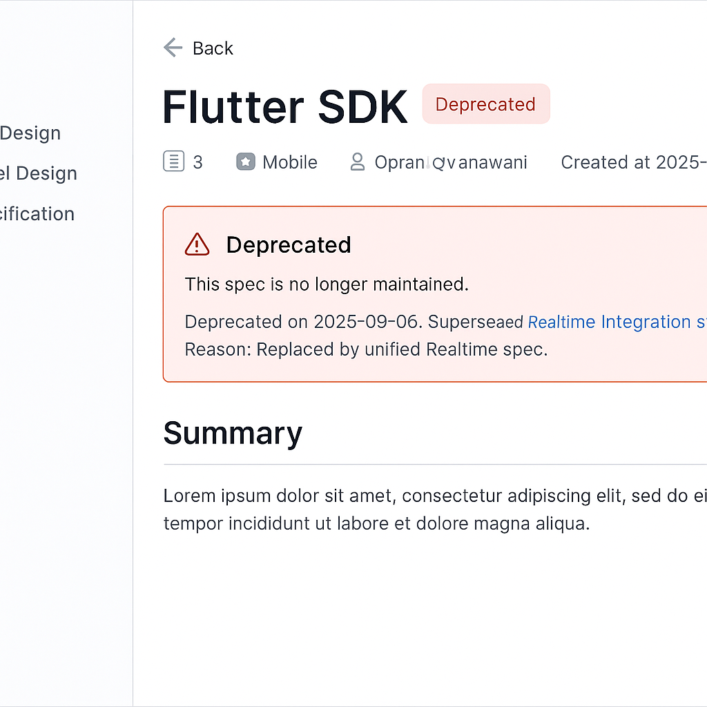
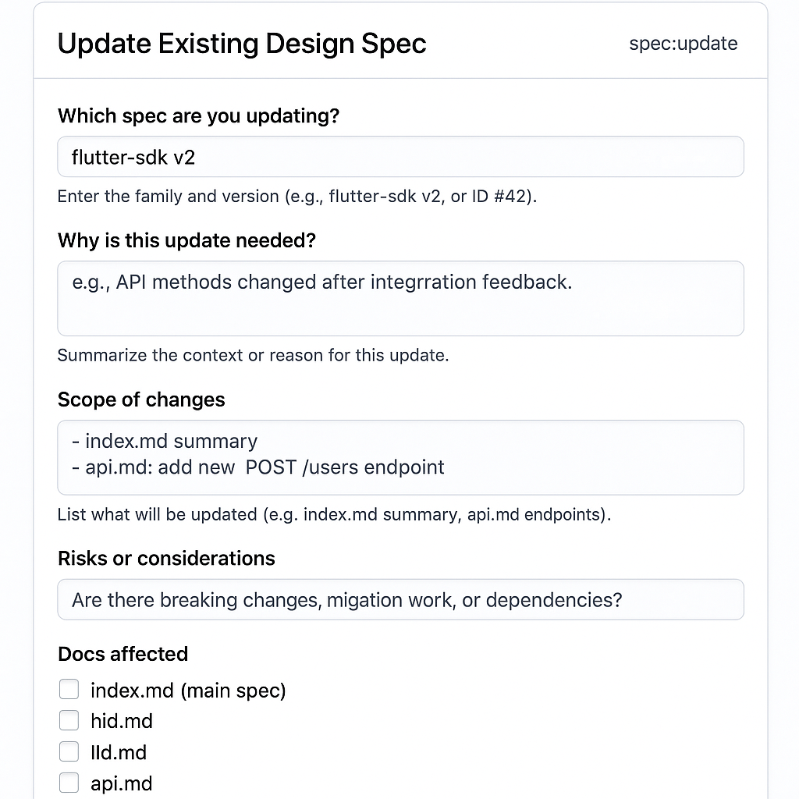
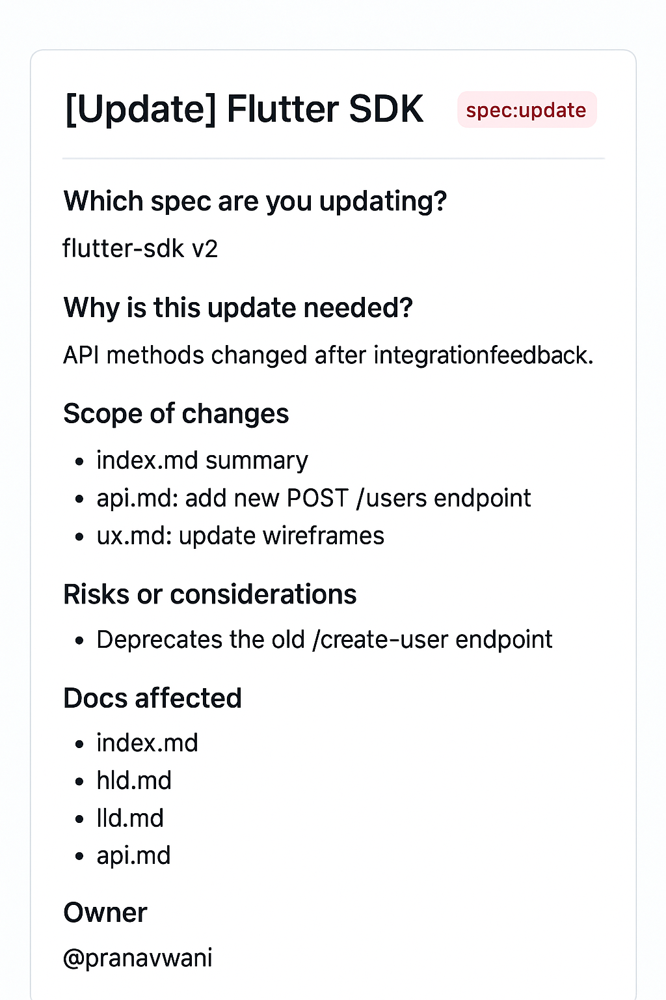
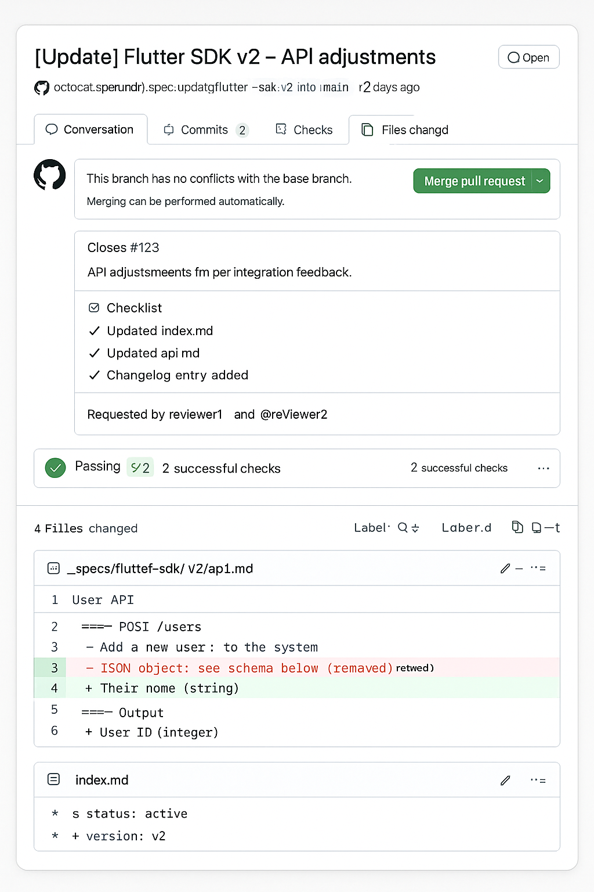
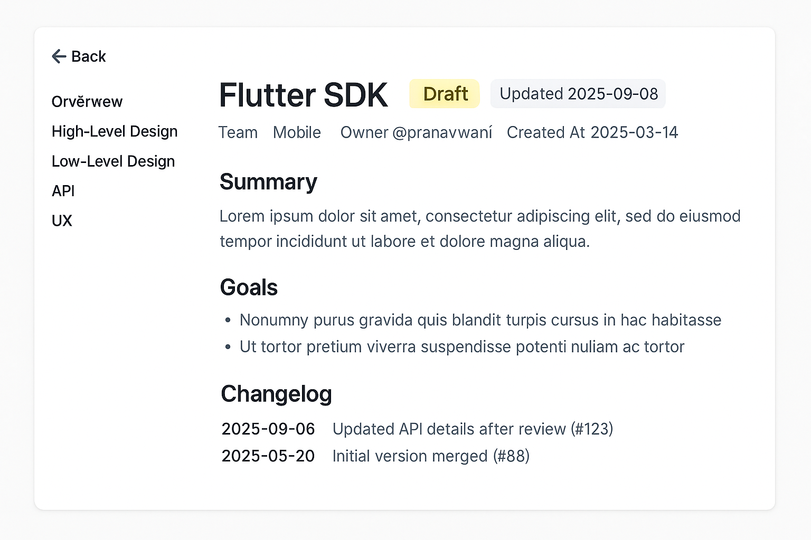
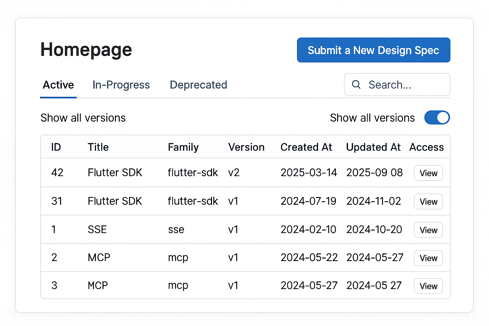

# ⚡ Proposal: Voltmx Design Specs Management System

## 1. Why this?

Today, design specs are scattered and hard to maintain. We need a **central, GitHub-native workflow** to:

* Standardize how specs are **proposed, reviewed, updated, and deprecated**.
* Provide a **single website** for all specs (published from GitHub Pages).
* Support **versioning & changelogs** for evolving specs.

---

## 2. Workflow (at a glance)

**New Spec**

1. Submit Proposal → GitHub Issue Form (`[Spec] <title>`).
2. Draft PR → scaffold folder `_specs/<family>/<version>/`.
3. Review & Merge → spec published on website under “Active.”

**Update Spec**

1. Submit Update Proposal → GitHub Issue Form (`[Update] <title> vX`).
2. Update PR → edits files, adds changelog entry, bumps `updated_at`.
3. Merge → updated spec + changelog visible on site.

**Deprecation / Versioning**

* Major changes → new version folder (`v2`).
* Old version marked `status: deprecated` with reason + superseded\_by.
* Homepage shows only **latest per family** (toggle to view all).

---

## 3. Repo & Site

**Repo Structure**

```
_specs/
  flutter-sdk/v1/index.md
  flutter-sdk/v2/index.md
.github/ISSUE_TEMPLATE/ (new-spec.yml, update-spec.yml)
.github/PULL_REQUEST_TEMPLATE.md
.github/workflows/validate-specs.yml
index.html   (homepage with tabs, search, table)
assets/      (styles)
mockups/     (UI images)
```

**Website Features**

* Tabs: Active / In-Progress / Deprecated.
* Table: ID · Title · Family · Version · Created At · (Updated At for all versions).
* Spec detail pages: sidebar navigation, badges (owner, team, status), changelog.
* Deprecated / Draft banners at top of pages.

---

## 4. Visual Mockups

*(These help PMs visualize the flow — stored under `/mockups/`)*

**1. Homepage**

**2. New Spec Proposal Form**

**3. Proposal Issue**

**4. Draft PR**

**5. Spec Detail Page**

**6. Deprecated Spec Page**

**7. Update Proposal Form**

**8. Update Proposal Issue**

**9. Update PR**

**10. Updated Spec Page (with changelog)**

**11. Homepage with “Show all versions” toggle**


---

## 5. Validation Rules (CI)

* `status` ∈ {active, in-progress, deprecated}.
* Unique `id`.
* `version = vN`.
* Only **one active version per family**.
* Updates require `updated_at` + `changelog`.
* Deprecations require `deprecated_at` + `reason`.

---

## 6. Ask for Approval ✅

We’re requesting approval to:

* Use **GitHub** as the single source of truth for design specs.
* Implement the workflow + CI guardrails described above.
* Publish the site via **GitHub Pages** as the entry point for all teams.

---
